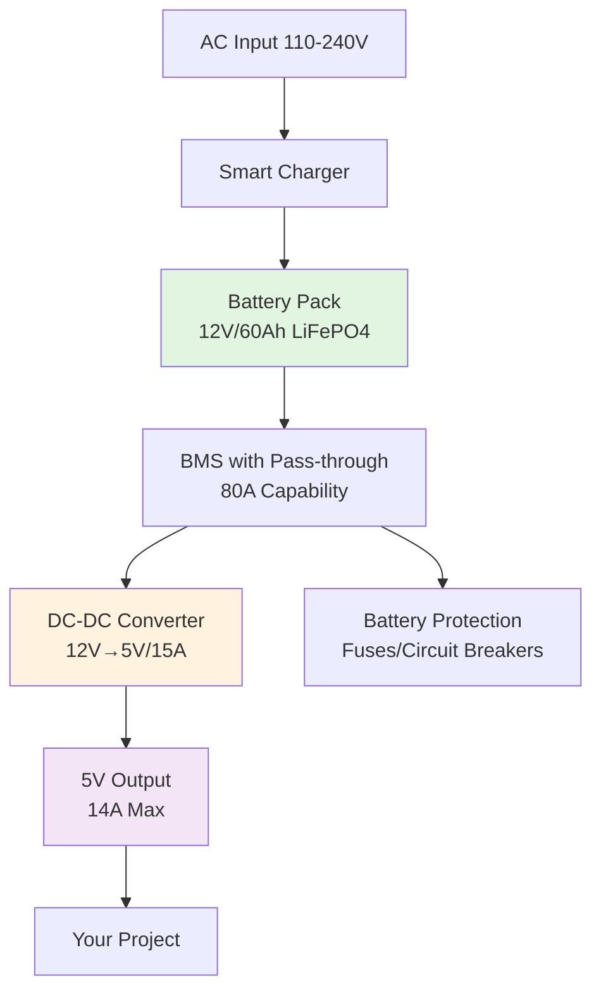
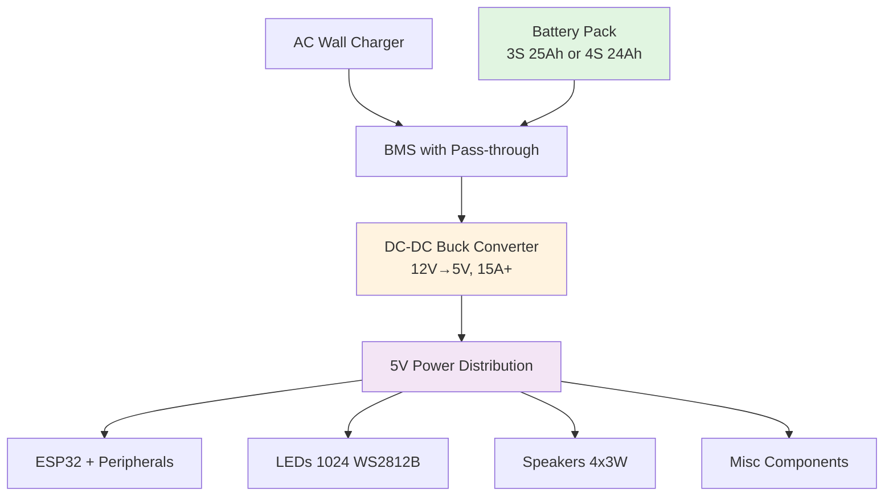

# I want a battery pack that I can dischar

**User - --**

I want a battery pack that I can discharge and charge at the same time that output 5V and that can deliver approx 70w during 10h for an electronic project

**Assistant - --**

Based on your requirements, here's a comprehensive breakdown of the battery pack solution you'll need, including key considerations and a recommended approach.

## 🎯 **Core Requirements & Key Design Factors**

| Requirement | Value | Implication |
|-------------|-------|-------------|
| **Output Voltage** | 5V | Needs buck/boost regulation |
| **Continuous Power** | ~70W | High current demand (~14A at 5V) |
| **Runtime** | 10 hours | Energy needed: **700Wh** |
| **Simultaneous Charge/Discharge** | Required | Needs pass-through charging capability |
| **Total Energy** | **700 watt-hours** | Large battery capacity needed |

### **Critical Design Considerations:**
1. **Pass-through Charging**: Not all battery management systems (BMS) support this
2. **High Current**: 14A at 5V requires thick wiring and robust connectors
3. **Efficiency**: DC-DC conversion losses will increase total energy needs
4. **Safety**: High-energy systems require proper protection circuits

## 🔋 **Recommended Battery Configuration**

<details>
<summary><strong>📊 Battery Specifications (Click to expand)</strong></summary>

### **Option A: LiFePO4 Battery (Recommended)**
- **Chemistry**: LiFePO4 (Lithium Iron Phosphate)
- **Voltage**: 12.8V nominal
- **Capacity**: **60Ah** (768Wh at 12.8V)
- **Cells**: 4S configuration
- **Why recommended**: Safer, longer lifespan (~2000 cycles), more stable

### **Option B: Lithium-ion Battery**
- **Chemistry**: Li-ion (18650 or 21700 cells)
- **Voltage**: 12V nominal (3S or 4S)
- **Capacity**: **65Ah+** (780Wh+)
- **Cells**: 13S4P or similar configuration
</details>

## ⚡ **Power Electronics Requirements**

<details>
<summary><strong>🔌 Required Components (Click to expand)</strong></summary>

| Component | Specification | Notes |
|-----------|---------------|-------|
| **Battery Management System (BMS)** | 12V/80A with pass-through charging | Must explicitly support simultaneous charge/discharge |
| **DC-DC Converter** | 12V→5V, 15A+ continuous output | Look for >90% efficiency |
| **Charger** | 12V/10A+ smart charger | For the 60Ah battery |
| **Protection** | Fuses, circuit breakers | 80A main fuse recommended |
| **Connectors** | XT90/XT150 for battery | Anderson PowerPole for 5V side |

### **Efficiency Calculation:**
Assuming 90% DC-DC efficiency:
- Required battery power: $P_{batt} = \frac{70W}{0.90} \approx 78W$
- Total energy over 10h: $E_{total} = 78W \times 10h = 780Wh$
- With 10% safety margin: $\approx 860Wh$
</details>

## 🛠️ **System Architecture**



## 💡 **Implementation Recommendations**

<details>
<summary><strong>🔧 Build vs Buy Decision (Click to expand)</strong></summary>

### **Option 1: DIY Build**
**Pros**: Customizable, potentially cheaper, educational  
**Cons**: Requires expertise, safety risks, time-consuming  

**Key components needed:**
1. LiFePO4 cells (16x 3.2V/20Ah for 4S4P)
2. 80A BMS with pass-through
3. 12V→5V buck converter (15A+)
4. Battery enclosure with ventilation
5. Safety equipment (fuses, thermal protection)

### **Option 2: Pre-built Solutions**
**All-in-one units that might work:**
- **Goal Zero Yeti 500X** (505Wh) - would need two
- **Jackery Explorer 500** (518Wh) - would need two
- **EcoFlow River 2 Max** (512Wh) - would need two

**Note**: Most commercial power stations support pass-through charging but verify specifications.
</details>

## ⚠️ **Critical Safety Notes**

<details>
<summary><strong>🚨 Safety First! (Click to expand)</strong></summary>

1. **Thermal Management**: 70W continuous generates significant heat
2. **Current Protection**: Implement both over-current and short-circuit protection
3. **Voltage Monitoring**: Include low-voltage cutoff to prevent battery damage
4. **Fire Safety**: Keep in fire-resistant enclosure, never leave unattended while charging
5. **Cell Balancing**: Essential for multi-cell packs to prevent imbalance
6. **Ventilation**: Ensure adequate airflow for DC-DC converter and battery
</details>

## 📋 **Cost Estimation**

| Component | Estimated Cost | Notes |
|-----------|---------------|-------|
| LiFePO4 Cells (60Ah) | $200-$300 | 16x 20Ah cells |
| BMS with Pass-through | $40-$80 | 80A minimum |
| DC-DC Converter | $30-$60 | High-efficiency buck |
| Enclosure & Wiring | $50-$100 | With safety features |
| Charger | $40-$80 | 12V/10A smart charger |
| **Total DIY** | **$360-$620** | Plus tools and time |
| **Commercial Unit** | **$800-$1200** | For equivalent capacity |

## 🔄 **Alternative Approach: Modular Design**

If finding a single 700Wh battery with pass-through is challenging, consider:
1. **Two 350Wh battery packs** in parallel
2. Each with its own BMS and DC-DC converter
3. Use a charge controller that can manage both simultaneously
4. Provides redundancy if one fails

## 📝 **Next Steps**

1. **Confirm your exact requirements**: Peak vs continuous current, acceptable voltage ripple
2. **Research BMS options**: Verify pass-through charging capability
3. **Consider thermal design**: Plan for heat dissipation
4. **Test with smaller scale**: Build a 100W prototype first if DIY

**Would you like me to elaborate on any specific aspect, such as BMS selection criteria, wiring diagrams, or thermal calculation methods?**

**User - --**

actually, I think I really oversized my needs 

## Power Budget Breakdown
| Component | Avg Current @5V | Peak | Duty Cycle | Notes |
|-----------|-----------------|------|------------|-------|
| **ESP32-S3 + Peripherals** (BLE/audio/mic/SD) | 150mA | 300mA | 100% | 3.3V LDO (AMS1117). |
| **LEDs** (1024 WS2812B, 20% bright) | **3.5A** | **10A** | 50% (animations) | Injection caps critical. |
| **Speakers** (4x3W, 60% vol) | **1.8A** | **3A** | 20% (sfx bursts) | MAX98357A eff. 85%. |
| **Misc** (fans? level shifters) | 50mA | 100mA | 100% | - |
| **Total** | **5.5A avg** / **13.4A peak** | - | - | 27W avg → 270Wh for 10hr. |

I think a 3S Lipo 5000maH is good, right? now what is the BMS needed? I want to be able to simultaneously charge/discharge

**Assistant - --**

Excellent! Your revised power budget is much more realistic and manageable. Let's analyze this properly.

## 📊 **Revised Power Analysis**

| Metric | Calculation | Value |
|--------|-------------|-------|
| **Average Current** | 150mA + 3.5A + 1.8A + 50mA | **5.5A** |
| **Average Power** | $5.5A \times 5V = 27.5W$ | **27.5W** |
| **Peak Current** | 300mA + 10A + 3A + 100mA | **13.4A** |
| **Peak Power** | $13.4A \times 5V = 67W$ | **67W** |
| **Energy for 10h** | $27.5W \times 10h = 275Wh$ | **275Wh** |

## 🔋 **3S LiPo Analysis**

<details>
<summary><strong>📈 Battery Math (Click to expand)</strong></summary>

### **3S LiPo Specifications:**
- **Nominal voltage**: 11.1V (3 × 3.7V)
- **Fully charged**: 12.6V (3 × 4.2V)
- **Discharged**: 9.0V (3 × 3.0V)

### **Capacity Calculation:**
For a 5000mAh (5Ah) 3S LiPo:
- **Energy capacity**: $11.1V \times 5Ah = 55.5Wh$

### **Runtime with 3S 5000mAh:**
1. **DC-DC efficiency**: Assume 90% for buck converter
2. **Required battery power**: $P_{batt} = \frac{27.5W}{0.90} \approx 30.6W$
3. **Battery current**: $I_{batt} = \frac{30.6W}{11.1V} \approx 2.76A$
4. **Runtime**: $\frac{5Ah}{2.76A} \approx 1.81$ hours

**Conclusion**: A single 3S 5000mAh battery gives you **less than 2 hours** of runtime, not 10 hours!
</details>

## 🎯 **Correct Battery Sizing for 10 Hours**

<details>
<summary><strong>🔋 Battery Requirements (Click to expand)</strong></summary>

### **Required Battery Capacity:**
1. **Total energy needed**: 275Wh (accounting for efficiency: ~305Wh)
2. **For 3S LiPo (11.1V)**: $Capacity = \frac{305Wh}{11.1V} \approx 27.5Ah$
3. **For 4S LiFePO4 (12.8V)**: $Capacity = \frac{305Wh}{12.8V} \approx 23.8Ah$

### **Recommended Battery Options:**
| Option | Chemistry | Configuration | Capacity | Weight | Cost |
|--------|-----------|---------------|----------|--------|------|
| **Option A** | LiFePO4 | 4S | 24Ah | ~2.5kg | $$ |
| **Option B** | Li-ion | 3S7P (21x 18650) | ~24.5Ah | ~1.8kg | $$ |
| **Option C** | LiPo | 3S | 25Ah | ~1.5kg | $$$ |

**Note**: 25Ah LiPo packs are large and expensive. LiFePO4 is safer for high-capacity applications.
</details>

## ⚡ **BMS Requirements for Simultaneous Charge/Discharge**

<details>
<summary><strong>🔌 BMS Selection Guide (Click to expand)</strong></summary>

### **Key BMS Features Needed:**
1. **Pass-through charging capability** (explicitly stated in specs)
2. **Current rating**: Must handle charge + discharge simultaneously
3. **Balance charging** for multi-cell packs

### **For 3S LiPo (25Ah pack):**
- **Discharge current**: Peak 13.4A at 5V → ~6A at 11.1V (accounting for efficiency)
- **Charge current**: Depends on charger (typically 0.5C = 12.5A for 25Ah)
- **Total BMS rating**: $6A + 12.5A \approx 19A$ minimum
- **Recommended**: **3S 25A BMS** with pass-through

### **For 4S LiFePO4 (24Ah pack):**
- **Discharge current**: ~5.3A at 12.8V
- **Charge current**: 0.5C = 12A
- **Total BMS rating**: ~17A minimum
- **Recommended**: **4S 25A BMS** with pass-through

### **Recommended BMS Models:**
1. **Daly Smart BMS** - Many support pass-through
2. **JK BMS** - Often has pass-through option
3. **JBD/Overkill Solar BMS** - Reliable with pass-through
</details>

## 🛠️ **Complete System Architecture**



## 💡 **Practical Implementation Recommendations**

<details>
<summary><strong>🔧 Build vs Buy Analysis (Click to expand)</strong></summary>

### **Option 1: DIY with LiFePO4 (Recommended)**
- **Battery**: 4S LiFePO4 24Ah (8x 12V 12Ah cells in parallel)
- **BMS**: 4S 25A Daly BMS with pass-through (~$40)
- **DC-DC**: 12V→5V 15A buck converter (~$25)
- **Charger**: 12V 10A LiFePO4 smart charger (~$30)
- **Total**: ~$200-250

### **Option 2: Commercial Power Bank**
- **Anker PowerHouse 521** (256Wh) - Almost enough
- **EcoFlow River 2** (256Wh) - Close but slightly undersized
- **Two units** of either would give you 10+ hours

### **Option 3: Modular Approach**
- **Two 12V 12Ah LiFePO4 batteries** in parallel
- **Each with its own BMS**
- **Load sharing between them**
</details>

## ⚠️ **Critical Considerations for Your Project**

<details>
<summary><strong>🚨 Important Design Notes (Click to expand)</strong></summary>

### **LED Power Management:**
- **1024 WS2812B at 20% brightness**: Your 3.5A estimate seems low
- **Each LED at 20%**: ~3mA × 1024 = ~3A (reasonable)
- **But peak white**: 60mA × 1024 = 61A! (impossible for your system)
- **Solution**: Implement current limiting in code, use power injection

### **Voltage Drop Concerns:**
- **14A peak at 5V** means significant voltage drop
- **Use thick wires**: 12AWG minimum for 5V distribution
- **Multiple injection points** for LEDs
- **Local capacitors** at LED strip inputs

### **Thermal Management:**
- **DC-DC converter efficiency**: 90% means 3W of heat at 27.5W load
- **Need heatsinking** for buck converter
- **Consider active cooling** if enclosed
</details>

## 📋 **Cost & Weight Estimate**

| Component | 3S LiPo 25Ah | 4S LiFePO4 24Ah | Notes |
|-----------|--------------|-----------------|-------|
| **Battery** | $150-$250 | $100-$150 | LiFePO4 cheaper per Wh |
| **BMS** | $30-$50 | $40-$60 | Both need pass-through |
| **DC-DC** | $20-$40 | $20-$40 | Same for both |
| **Charger** | $30-$50 | $30-$50 | Chemistry-specific |
| **Enclosure** | $20-$40 | $20-$40 | - |
| **Total** | **$250-$430** | **$210-$340** | LiFePO4 wins |
| **Weight** | ~1.5kg | ~2.5kg | LiFePO4 heavier |

## 🔄 **Alternative: Smaller Battery + External Power**

If portability isn't critical:
1. **Use a 12V 7Ah battery** for ~2.5 hours runtime
2. **Keep it plugged into wall power** when available
3. **Implement automatic switching** between battery and wall power

## ❓ **Questions for Your Consideration:**

1. **Is portability essential?** Or can it be plugged in sometimes?
2. **What's your actual LED usage pattern?** 50% duty cycle might be optimistic
3. **Have you considered using 12V LED strips** to avoid the 5V conversion loss?
4. **What's your budget constraint?**

**Would you like me to provide specific part numbers for the BMS and DC-DC converter, or help with the wiring diagram for the pass-through charging setup?**

**User - --**

can you design a power circuit for a 3S LiPo 5000mAh battery with BMS and usb-c charging. I also want to be able to run the load if usb-c brings electricity (load + charge battery) and when usb-c is not connected, batterie switch to discharge. I want that when I unplug, the system does not shutdown abruptly.

**Assistant - --**

# 3S LiPo Power System Design with USB-C Charging & Seamless Switching

## Overview

You need a **UPS-style** power system that:
1. Charges the 3S LiPo via USB-C PD
2. Powers the load simultaneously
3. Seamlessly switches between USB and battery (no brownouts)
4. Handles 5.5A average / 13A peak at 5V output

---

## System Architecture

```
┌─────────────────────────────────────────────────────────────────────────────┐
│                                                                             │
│   USB-C PD          DC-DC Buck              Load                            │
│   ┌───────┐        ┌─────────┐            ┌──────┐                          │
│   │ 15V/3A├───┬───►│ 15V→5V  ├──────┬────►│ 5.5A │                          │
│   │  45W  │   │    │  45W    │      │     │ avg  │                          │
│   └───────┘   │    └─────────┘      │     └──────┘                          │
│               │                     │                                       │
│               │    ┌─────────┐      │                                       │
│               └───►│ Charger ├──┐   │                                       │
│                    │ 2A CC/CV│  │   │                                       │
│                    └─────────┘  │   │                                       │
│                                 │   │                                       │
│                    ┌─────────┐  │   │     ┌─────────┐                       │
│                    │   BMS   │◄─┘   │     │ OR Gate │                       │
│                    │  3S 20A │      └────►│ (Diode) │──► Stable 5V Out      │
│                    └────┬────┘           ┌┴─────────┘                       │
│                         │                │                                  │
│                    ┌────┴────┐     ┌─────┴───┐                              │
│                    │ 3S LiPo │     │Buck-Boost│                             │
│                    │ 5000mAh ├────►│ 9-12V→5V │                             │
│                    └─────────┘     └─────────┘                              │
│                                                                             │
└─────────────────────────────────────────────────────────────────────────────┘
```

---

## Component Selection

### 1. USB-C PD Trigger/Controller

| Option | Voltage | Current | Notes |
|--------|---------|---------|-------|
| **IP2721** | 9V/12V/15V/20V | 5A | Simple, resistor-programmed |
| **FUSB302 + MCU** | Negotiable | 5A | Full PD, complex |
| **CH224K** | 5-20V | 5A | Easy, fixed voltage pins |

**Recommendation: CH224K** - Set to request **15V/3A (45W)**

<details>
<summary><strong>CH224K Wiring</strong></summary>

```
        USB-C Connector
            │
      ┌─────┴─────┐
      │  CC1  CC2 │
      │   │    │  │
      │   └──┬─┘  │
      │      │    │
      │  ┌───┴───┐│
      │  │CH224K ││
      │  ├───────┤│
      │  │CFG1=GND││◄── 15V output
      │  │CFG2=GND││
      │  │CFG3=VCC││
      │  └───┬───┘│
      │      │    │
      └──────┼────┘
             │
         VBUS (15V)
```

CFG pins for 15V: `CFG1=L, CFG2=L, CFG3=H`

</details>

---

### 2. BMS Selection (3S, 20A+ continuous)

For **13A peaks** and **5.5A continuous** at the battery, you need headroom:

| BMS | Continuous | Peak | Balance | Price |
|-----|------------|------|---------|-------|
| **HX-3S-D20** | 20A | 40A | Yes, 42mA | ~$3 |
| **JBD-SP04S020** | 20A | 60A | Yes, 60mA | ~$8 |
| **Daly 3S 30A** | 30A | 60A | Yes | ~$12 |

**Recommendation: JBD-SP04S020** or similar 20A+ BMS with:
- Overcurrent protection: 25A
- Overcharge: 4.25V/cell
- Overdischarge: 2.8V/cell
- Balance current: 42-60mA

<details>
<summary><strong>BMS Wiring Diagram</strong></summary>

```
    3S LiPo Pack (11.1V nominal, 12.6V full)
    ┌─────────────────────────────────┐
    │  ┌─────┐  ┌─────┐  ┌─────┐     │
    │  │Cell1│  │Cell2│  │Cell3│     │
    │  │3.7V │  │3.7V │  │3.7V │     │
    │  └──┬──┘  └──┬──┘  └──┬──┘     │
    │     │        │        │        │
    └─────┼────────┼────────┼────────┘
          │        │        │
          B-       B1       B2       B+
          │        │        │        │
    ┌─────┴────────┴────────┴────────┴─────┐
    │              3S BMS 20A              │
    │                                       │
    │   P-  ◄── Discharge output           │
    │   P+  ◄── Discharge output           │
    │   C-  ◄── Charge input (if separate) │
    └───────────────────────────────────────┘
```

**Wire Gauges:**
- Balance wires: 24 AWG
- Power wires (P+/P-): **14 AWG minimum** for 20A

</details>

---

### 3. Charging Circuit

For **3S LiPo** charging via 15V input:

| Charger IC | Max Current | Input | Features |
|------------|-------------|-------|----------|
| **TP5100** | 2A | 5-18V | Dual-cell only ❌ |
| **CN3722** | 5A | 12-24V | MPPT, CC/CV ✓ |
| **LTC4007** | 4A | Up to 28V | High-end ✓ |
| **BQ24650** | 5A | Up to 28V | Excellent ✓ |

**Recommendation: CN3722** - Cheap, available, works with 15V input for 3S

<details>
<summary><strong>CN3722 Charging Circuit</strong></summary>

```
     15V from CH224K
          │
          │
    ┌─────┴─────┐
    │   CN3722  │
    │           │
    │ VIN   BAT ├────► To BMS B+ (12.6V max)
    │           │
    │ CS    GND ├────► To BMS B-
    │           │
    └─────┬─────┘
          │
         Rsense (for 2A charge: 0.05Ω)
```

**Key Component Values:**
- **Rsense** = 0.1Ω for 1.5A charge, 0.05Ω for 2.5A
- **Voltage set resistors** for 12.6V (3S full charge)

Charge time at 2A: $t = \frac{5000\text{mAh}}{2000\text{mA}} = 2.5\text{h}$

</details>

---

### 4. DC-DC Converters

You need **two paths** to 5V:

#### Path A: USB-C → 5V (Primary when plugged in)
| Module | Input | Output | Efficiency |
|--------|-------|--------|------------|
| **XL4015** | 8-36V | 5V/5A | 85% |
| **LM2596** | 7-35V | 5V/3A | ❌ Too weak |
| **MP1584** | 4.5-28V | 5V/3A | ❌ Too weak |
| **XL4016** | 8-40V | 5V/8A | 88% ✓ |

**Recommendation: XL4016 module** (15V→5V, 8A capable)

#### Path B: Battery → 5V (Backup when unplugged)
The 3S battery is 9.0V (empty) to 12.6V (full), so a **buck converter** works:

| Module | Input | Output | Notes |
|--------|-------|--------|-------|
| **XL4016** | 8-40V | 5V/8A | Same as above ✓ |
| **LTC3780** | 5-32V | 5V/10A | Buck-boost, overkill |

**Use another XL4016** for the battery path.

---

### 5. Seamless Switching (The Critical Part!)

To prevent brownouts when unplugging USB-C, use an **ideal diode OR-ing** circuit:

```
                    ┌───────────────┐
   USB 15V ──►XL4016──►│5V Path A     │
                    │               │──►┌──────────┐
                    │  Ideal Diode  │   │          │
                    │  LTC4357 or   │   │  5V OUT  │──► To Load
                    │  Schottky OR  │   │          │
                    │               │──►└──────────┘
   Battery ──►XL4016──►│5V Path B     │
                    └───────────────┘
```

#### Option 1: Simple Schottky Diode OR (Cheap but lossy)

```
   5V from USB path ────┐
                        │
                   ┌────┴────┐
                   │ SS54    │  (5A Schottky, 0.5V drop)
                   │ Diode   │
                   └────┬────┘
                        ├──────────► 5V OUT (~4.5V)
                   ┌────┴────┐
                   │ SS54    │
                   │ Diode   │
                   └────┬────┘
                        │
   5V from Batt path ───┘
```

**Problem:** 0.5V drop × 6A = **3W wasted heat**

#### Option 2: Ideal Diode Controller (Recommended)

Use **LTC4357** or **LM74700** for near-zero drop:

```
   5V USB Path ──────┬──────────────────────────────┐
                     │                              │
                ┌────┴────┐                         │
                │ LTC4357 │                         │
                │ + MOSFET│ (Si4435, P-ch, 20mΩ)    │
                └────┬────┘                         │
                     │                              ▼
                     └─────────────────────► 5V OUT (Load)
                     ┌─────────────────────►
                     │                              ▲
                ┌────┴────┐                         │
                │ LTC4357 │                         │
                │ + MOSFET│                         │
                └────┴────┘                         │
                     │                              │
   5V Batt Path ─────┴──────────────────────────────┘
```

<details>
<summary><strong>LTC4357 Circuit Detail</strong></summary>

```
                      VCC
                       │
              ┌────────┴────────┐
              │     LTC4357     │
              │                 │
    IN ──┬────┤IN           OUT├────┬── OUT
         │    │                 │    │
         │    │     GATE───────┼────┤
         │    │                 │    │
         │    └────────┬────────┘    │
         │             │             │
         │            GND            │
         │                           │
         │    ┌─────────────┐        │
         └────┤S    PMOS   D├────────┘
              │  Si4435    │
              │  (P-ch)    │
              └──────┬─────┘
                     │
                     G (to GATE pin)
```

- **Forward drop:** ~20mV at 5A (vs 500mV for Schottky)
- **Power loss:** 0.1W vs 3W!

</details>

---

## Complete Schematic

```
┌─────────────────────────────────────────────────────────────────────────────────────┐
│                                                                                     │
│  ┌─────────────┐                                                                    │
│  │   USB-C     │                                                                    │
│  │  Connector  │                                                                    │
│  └──────┬──────┘                                                                    │
│         │                                                                           │
│         ▼                                                                           │
│  ┌─────────────┐     15V/3A                                                         │
│  │   CH224K    ├─────────┬──────────────────────────────┐                           │
│  │  PD Trigger │         │                              │                           │
│  └─────────────┘         │                              │                           │
│                          │                              ▼                           │
│                          │                       ┌─────────────┐                    │
│                          │                       │   CN3722    │                    │
│                          │                       │  Charger    │                    │
│                          │                       │   2-3A      │                    │
│                          │                       └──────┬──────┘                    │
│                          │                              │                           │
│                          ▼                              ▼                           │
│                   ┌─────────────┐              ┌─────────────────┐                  │
│                   │   XL4016    │              │    3S BMS       │                  │
│                   │  15V → 5V   │              │    20A          │                  │
│                   │    8A       │              │  (JBD-SP04S020) │                  │
│                   └──────┬──────┘              └────────┬────────┘                  │
│                          │                              │                           │
│                          │ 5V                           │ P+/P- (9-12.6V)           │
│                          │                              │                           │
│                          ▼                              ▼                           │
│               ┌──────────────────┐           ┌─────────────┐                        │
│               │    LTC4357 #1    │           │   XL4016    │                        │
│               │  + Si4435 PMOS   │           │ Batt → 5V   │                        │
│               └────────┬─────────┘           │    8A       │                        │
│                        │                     └──────┬──────┘                        │
│                        │                            │                               │
│                        │                            ▼                               │
│                        │                 ┌──────────────────┐                       │
│                        │                 │    LTC4357 #2    │                       │
│                        │                 │  + Si4435 PMOS   │                       │
│                        │                 └────────┬─────────┘                       │
│                        │                          │                                 │
│                        └──────────┬───────────────┘                                 │
│                                   │                                                 │
│                                   ▼                                                 │
│                         ┌─────────────────┐                                         │
│                         │   Bulk Caps     │                                         │
│                         │  4×1000µF 10V   │                                         │
│                         │  + 100µF Tant   │                                         │
│                         └────────┬────────┘                                         │
│                                  │                                                  │
│                                  ▼                                                  │
│                            ┌──────────┐                                             │
│                            │  5V OUT  │                                             │
│                            │  6A avg  │                                             │
│                            │  13A peak│                                             │
│                            └──────────┘                                             │
│                                                                                     │
│  ┌───────────────────────────────────────────────────────────────────────────────┐  │
│  │                          3S LiPo 5000mAh                                      │  │
│  │                      (Connected to BMS B0-B3)                                 │  │
│  └───────────────────────────────────────────────────────────────────────────────┘  │
│                                                                                     │
└─────────────────────────────────────────────────────────────────────────────────────┘
```

---

## Bill of Materials

| Component | Part Number | Qty | ~Price |
|-----------|-------------|-----|--------|
| USB-C PD Trigger | CH224K module | 1 | $2 |
| 3S BMS 20A | JBD-SP04S020 | 1 | $8 |
| 3S Charger | CN3722 module | 1 | $5 |
| Buck Converter (USB path) | XL4016 5V/8A module | 1 | $4 |
| Buck Converter (Batt path) | XL4016 5V/8A module | 1 | $4 |
| Ideal Diode Controller | LTC4357 | 2 | $6 |
| P-ch MOSFET | Si4435 or equivalent | 2 | $2 |
| Bulk Capacitors | 1000µF 10V electrolytic | 4 | $2 |
| 3S LiPo Battery | 5000mAh 30C | 1 | $30 |
| USB-C Connector | 16-pin SMD | 1 | $1 |
| **Total** | | | **~$64** |

---

## Runtime Calculation

$$\text{Runtime} = \frac{\text{Battery Wh}}{\text{Average Power}} = \frac{5\text{Ah} \times 11.1\text{V}}{27\text{W}} \approx 2\text{ hours}$$

**Wait - that's only 2 hours, not 10!** 

For 10 hours at 27W average:
$$\text{Required capacity} = 27\text{W} \times 10\text{h} = 270\text{Wh}$$

$$\text{Required Ah} = \frac{270\text{Wh}}{11.1\text{V}} = 24.3\text{Ah}$$

**You need ~25,000mAh (25Ah)**, not 5000mAh! That's **5× more battery**.

---

## Options for 10-Hour Runtime

| Option | Configuration | Weight | Cost |
|--------|---------------|--------|------|
| **5× 3S 5000mAh in parallel** | 3S 25000mAh | ~1.5kg | $150 |
| **3S 10000mAh × 3 parallel** | 3S 30000mAh | ~1.8kg | $180 |
| **Reduce LED brightness** | Save 50% power | - | $0 |

### Revised Power Budget (Realistic)

If you reduce LED brightness from 20% to **10%** and speaker duty cycle:

| Component | New Current | Power |
|-----------|-------------|-------|
| ESP32-S3 | 150mA | 0.75W |
| LEDs (10% bright) | 1.75A | 8.75W |
| Speakers (10% duty) | 0.36A | 1.8W |
| Misc | 50mA | 0.25W |
| **Total** | **2.3A** | **11.5W** |

New runtime with 5000mAh:
$$\text{Runtime} = \frac{55.5\text{Wh}}{11.5\text{W}} \approx 4.8\text{ hours}$$

Still not 10h, but much better!

---

## Summary

1. **Your 5000mAh 3S gives ~2h at full power, ~5h at reduced brightness**
2. For 10h, you need **3S 25000mAh** (5 packs in parallel)
3. The circuit design above handles seamless USB/battery switching
4. Use **ideal diode controllers** (LTC4357) to prevent brownouts
5. The **CN3722 + XL4016** combo handles charging and conversion efficiently

Would you like me to detail the parallel battery configuration, or help optimize your power budget further?

**User - --**

is this circuit "standard" for such IoT projects ?

**Assistant - --**

# Is This Circuit Standard? Yes and No.

## The Short Answer

**The individual blocks are standard, but the full "UPS-style" seamless switching is overkill for most IoT projects.**

Most hobbyist/maker projects use much simpler approaches. Let me break down what's "normal" vs what you're asking for:

---

## What Most IoT Projects Actually Use

### Tier 1: The 90% Solution (Most Common)

```
┌─────────────┐     ┌─────────────┐     ┌──────────┐
│ USB 5V In   ├────►│ TP4056+DW01 ├────►│ 1S LiPo  │
│ (charge)    │     │ (all-in-one)│     │ 3.7V     │
└─────────────┘     └──────┬──────┘     └────┬─────┘
                          │                  │
                    ┌─────┴──────────────────┘
                    │
                    ▼
              ┌───────────┐     ┌──────────┐
              │ MT3608    ├────►│ 5V Load  │
              │ Boost 5V  │     │ (1-2A)   │
              └───────────┘     └──────────┘
```

**Cost:** ~$2-3 total
**Power:** 1-2A max
**Limitation:** **Cannot charge and discharge simultaneously** (load disconnects during charge)

This is what 90% of ESP32/Arduino projects use. It's fine for:
- Low power sensors
- Simple displays
- Small LED strips (< 100 LEDs)

---

### Tier 2: Powerbank Module Approach (Common for Higher Power)

```
┌─────────────┐     ┌─────────────────┐     ┌──────────┐
│ USB-C In    ├────►│ IP5306 / IP5328 ├────►│ 5V Load  │
│             │     │ Powerbank SoC   │     │ (2-3A)   │
└─────────────┘     └────────┬────────┘     └──────────┘
                             │
                        ┌────┴────┐
                        │ 1S LiPo │
                        │ 3.7V    │
                        └─────────┘
```

| Chip | Max Output | Pass-through? | Price |
|------|------------|---------------|-------|
| **IP5306** | 2.4A | Yes (limited) | $0.50 |
| **IP5328P** | 3A | Yes | $1.50 |
| **SW6106** | 5A | Yes, full | $2 |

**This is the "standard" for simultaneous charge/discharge under 3A.**

<details>
<summary><strong>Why this works for most projects</strong></summary>

- Single chip solution
- Built-in battery protection
- USB-C PD negotiation (some chips)
- Pass-through charging
- LED fuel gauge
- ~$5 for complete module on AliExpress

**But:** Limited to 1S (3.7V), max ~15W output

</details>

---

### Tier 3: What You're Building (Professional/Industrial)

Your requirements push you into **professional UPS territory**:

| Requirement | Why It's Complex |
|-------------|------------------|
| 27W average load | Too high for powerbank chips |
| 13A peak | Needs beefy MOSFETs |
| 3S battery | No cheap all-in-one solutions |
| Seamless switching | Requires ideal diode OR-ing |
| USB-C PD charging | Needs separate PD controller |

**This is what you find in:**
- Commercial UPS systems
- Electric vehicles
- Professional camera/lighting gear
- Medical devices
- Industrial IoT gateways

---

## Comparison Table

| Approach | Max Power | Charge+Discharge | Seamless | Cost | Complexity |
|----------|-----------|------------------|----------|------|------------|
| TP4056 + Boost | 5W | ❌ | ❌ | $3 | ⭐ |
| IP5306 module | 12W | ✅ (limited) | ⚠️ | $5 | ⭐ |
| SW6106 module | 25W | ✅ | ✅ | $8 | ⭐⭐ |
| **Your design** | **65W+** | ✅ | ✅ | $60+ | ⭐⭐⭐⭐ |
| Commercial UPS | 100W+ | ✅ | ✅ | $100+ | ⭐⭐⭐⭐⭐ |

---

## Simpler Alternatives for Your Project

### Option A: Use a Commercial UPS Module

**DFRobot Solar Power Manager** or **Pimoroni LiPo SHIM**

```
┌──────────────────────────────────────────────┐
│  Adafruit PowerBoost 1000C                   │
│  ┌─────────┐                                 │
│  │ USB In  ├──► Charges battery              │
│  │         │                                 │
│  │ Battery ├──► 1S LiPo 3.7V                 │
│  │         │                                 │
│  │ 5V Out  ├──► 1A continuous, 2A peak       │
│  │         │    (Pass-through while charging)│
│  └─────────┘                                 │
└──────────────────────────────────────────────┘
```

**Limitation:** Only 1A continuous - **not enough for you**

---

### Option B: Split Your Load

Run **LEDs on separate battery**, ESP32 on small UPS:

```
┌─────────────────────────────────────────────────────────┐
│                                                         │
│  ┌─────────────┐      ┌─────────────┐                   │
│  │ ESP32 + Amp │◄─────┤ IP5306 UPS  │◄──── USB-C 5V     │
│  │   (~1A)     │      │ + 1S 3000mAh│                   │
│  └─────────────┘      └─────────────┘                   │
│                                                         │
│  ┌─────────────┐      ┌─────────────┐                   │
│  │ 1024 LEDs   │◄─────┤ 3S 5000mAh  │◄──── Separate     │
│  │   (~3.5A)   │      │ + BMS only  │      charger      │
│  └─────────────┘      └─────────────┘                   │
│                                                         │
└─────────────────────────────────────────────────────────┘
```

**Pros:** Simpler, ESP32 never loses power
**Cons:** Two batteries, two chargers, more bulk

---

### Option C: The "Good Enough" Hack

Use a **high-quality USB-C PD powerbank** with pass-through:

| Powerbank | Capacity | Output | Pass-through |
|-----------|----------|--------|--------------|
| Anker 737 | 24000mAh | 140W | ✅ Yes |
| Baseus 65W | 20000mAh | 65W | ✅ Yes |
| Xiaomi 50W | 20000mAh | 50W | ✅ Yes |

**Your project → Powerbank → USB-C PD (15V/3A) → XL4016 → 5V/6A**

```
┌─────────────┐     ┌─────────────┐     ┌─────────────┐     ┌──────────┐
│ Wall USB-C  ├────►│ 20Ah Power  ├────►│ XL4016     ├────►│ Your     │
│ Charger     │     │ Bank (PD)   │     │ 15V→5V 8A  │     │ Project  │
└─────────────┘     └─────────────┘     └─────────────┘     └──────────┘
```

**This is probably the most practical solution!**

Runtime: $\frac{20\text{Ah} \times 3.7\text{V} \times 0.85}{27\text{W}} \approx 2.3\text{h}$ per full charge

---

## My Recommendation

| If... | Then use... |
|-------|-------------|
| You want **simplicity** | Commercial powerbank + buck converter |
| You want **learning experience** | Build the full circuit I designed |
| You need **true 10h runtime** | Multiple 3S packs + custom BMS |
| Budget is tight | SW6106 module + 1S large capacity |

### The "Sweet Spot" for Your Project

```
┌─────────────────────────────────────────────────────────────────┐
│                                                                 │
│   USB-C PD 45W ──► SW6106 Module ──┬──► 5V/3A to ESP32+Audio    │
│        │              │            │                            │
│        │         1S 10000mAh       │                            │
│        │                           │                            │
│        └──► Separate 3S Pack ──────┴──► 5V to LEDs (direct)     │
│             + Simple BMS                                        │
│                                                                 │
└─────────────────────────────────────────────────────────────────┘
```

- ESP32 stays powered (UPS mode) via SW6106
- LEDs can brown out briefly (they recover instantly)
- Much simpler overall

---

## TL;DR

| Question | Answer |
|----------|--------|
| Is your circuit standard? | **No** - it's professional-grade |
| What's standard for IoT? | TP4056 or IP5306 modules |
| Why is yours complex? | High power (27W) + seamless switching |
| Should you build it? | **Yes, if learning is the goal** |
| Easier alternative? | Good USB-C powerbank + buck converter |

Would you like me to detail the SW6106 approach, or stick with the full custom design?

**User - --**

are you able to generate my design with a textual format that I can import in KiCad ?

**Assistant - --**

# KiCad Netlist/Schematic Generation

## The Honest Answer

**I cannot generate a directly importable KiCad file** that would work reliably. Here's why:

| Format | Can I Generate? | Would It Work? |
|--------|-----------------|----------------|
| `.kicad_sch` (v6/7/8) | ⚠️ Partially | ❌ Too complex, UUIDs, coordinates |
| `.kicad_pcb` | ❌ No | ❌ Requires footprint placement |
| **Netlist `.net`** | ✅ Yes | ⚠️ Components need symbols first |
| **SKiDL (Python)** | ✅ Yes | ✅ Best option! |
| **EasyEDA JSON** | ✅ Yes | ✅ Then convert to KiCad |

---

## Best Options for You

### Option 1: SKiDL (Python → KiCad Netlist)

SKiDL is a Python library that generates KiCad netlists programmatically:

```bash
pip install skidl
```

<details>
<summary><strong>Full SKiDL Script for Your Power Circuit</strong></summary>

```python
#!/usr/bin/env python3
"""
3S LiPo UPS Power System for IoT Project
Generates KiCad netlist via SKiDL
"""

from skidl import *

# Set default tool to KiCad
set_default_tool(KICAD)

# ============================================================
# POWER INPUT - USB-C with PD Trigger
# ============================================================

# USB-C Connector
usb_c = Part('Connector', 'USB_C_Receptacle_USB2.0', 
             footprint='Connector_USB:USB_C_Receptacle_GCT_USB4105-xx-A')

# CH224K USB PD Trigger (request 15V)
ch224k = Part('Interface_USB', 'CH224K', footprint='Package_SO:SOIC-8_3.9x4.9mm_P1.27mm')

# PD Trigger Configuration Resistors (for 15V: CFG1=L, CFG2=L, CFG3=H)
r_cfg3 = Part('Device', 'R', value='10k', footprint='Resistor_SMD:R_0603_1608Metric')

# Input capacitors
c_usb_in = Part('Device', 'C', value='10uF', footprint='Capacitor_SMD:C_0805_2012Metric')
c_pd_out = Part('Device', 'C', value='22uF', footprint='Capacitor_SMD:C_0805_2012Metric')

# ============================================================
# CHARGING CIRCUIT - CN3722 for 3S LiPo
# ============================================================

# CN3722 Charger IC (alternative: use generic buck charger symbol)
# Note: CN3722 may not be in standard libs - use placeholder
cn3722 = Part('Regulator_Switching', 'LM2596S-ADJ', 
              footprint='Package_TO_SOT_SMD:TO-263-5_TabPin3')  # Placeholder

# Charge current sense resistor (0.1Ω for ~1.5A, 0.05Ω for ~3A)
r_sense_chg = Part('Device', 'R', value='0.1', footprint='Resistor_SMD:R_1206_3216Metric')

# Voltage divider for 12.6V (3S) output
r_fb1_chg = Part('Device', 'R', value='100k', footprint='Resistor_SMD:R_0603_1608Metric')
r_fb2_chg = Part('Device', 'R', value='12k', footprint='Resistor_SMD:R_0603_1608Metric')

# Inductor and output cap
l_chg = Part('Device', 'L', value='33uH', footprint='Inductor_SMD:L_Bourns_SRN8040')
c_chg_out = Part('Device', 'C', value='47uF', footprint='Capacitor_SMD:C_1206_3216Metric')

# Schottky diode
d_chg = Part('Device', 'D_Schottky', value='SS54', footprint='Diode_SMD:D_SMA')

# ============================================================
# 3S BMS (Module - represented as connector)
# ============================================================

# BMS connection header (B-, B1, B2, B+, P-, P+)
bms_header = Part('Connector', 'Conn_01x06', 
                  footprint='Connector_PinHeader_2.54mm:PinHeader_1x06_P2.54mm_Vertical')
bms_header.ref = 'J_BMS'

# Battery connector
batt_conn = Part('Connector', 'Conn_01x02', 
                 footprint='Connector_JST:JST_XH_B2B-XH-A_1x02_P2.50mm_Vertical')
batt_conn.ref = 'J_BATT'

# ============================================================
# DC-DC CONVERTER 1: 15V → 5V (USB Path)
# ============================================================

# XL4016 Buck Converter (using LM2596 as placeholder in std libs)
buck_usb = Part('Regulator_Switching', 'LM2596S-5.0',
                footprint='Package_TO_SOT_SMD:TO-263-5_TabPin3')
buck_usb.ref = 'U_BUCK_USB'

# Input caps
c_buck1_in = Part('Device', 'CP', value='220uF', 
                  footprint='Capacitor_THT:CP_Radial_D8.0mm_P3.50mm')

# Output caps
c_buck1_out1 = Part('Device', 'CP', value='470uF', 
                    footprint='Capacitor_THT:CP_Radial_D10.0mm_P5.00mm')
c_buck1_out2 = Part('Device', 'C', value='100uF', 
                    footprint='Capacitor_SMD:C_1206_3216Metric')

# Inductor
l_buck1 = Part('Device', 'L', value='47uH', footprint='Inductor_SMD:L_Bourns_SRN8040')

# Schottky
d_buck1 = Part('Device', 'D_Schottky', value='SS54', footprint='Diode_SMD:D_SMA')

# ============================================================
# DC-DC CONVERTER 2: Battery → 5V (Battery Path)
# ============================================================

buck_batt = Part('Regulator_Switching', 'LM2596S-5.0',
                 footprint='Package_TO_SOT_SMD:TO-263-5_TabPin3')
buck_batt.ref = 'U_BUCK_BATT'

c_buck2_in = Part('Device', 'CP', value='220uF', 
                  footprint='Capacitor_THT:CP_Radial_D8.0mm_P3.50mm')
c_buck2_out1 = Part('Device', 'CP', value='470uF', 
                    footprint='Capacitor_THT:CP_Radial_D10.0mm_P5.00mm')
c_buck2_out2 = Part('Device', 'C', value='100uF', 
                    footprint='Capacitor_SMD:C_1206_3216Metric')
l_buck2 = Part('Device', 'L', value='47uH', footprint='Inductor_SMD:L_Bourns_SRN8040')
d_buck2 = Part('Device', 'D_Schottky', value='SS54', footprint='Diode_SMD:D_SMA')

# ============================================================
# IDEAL DIODE OR-ING (LTC4357 + P-MOSFET)
# ============================================================

# Ideal diode controller 1 (USB path)
# LTC4357 not in std libs - use placeholder
ideal_diode1 = Part('Device', 'D_Schottky', value='LTC4357+FET', 
                    footprint='Package_SO:SOIC-8_3.9x4.9mm_P1.27mm')
ideal_diode1.ref = 'U_ORING1'

# P-channel MOSFET for ideal diode 1
q_or1 = Part('Device', 'Q_PMOS_GSD', value='Si4435', 
             footprint='Package_SO:SOIC-8_3.9x4.9mm_P1.27mm')

# Ideal diode controller 2 (Battery path)
ideal_diode2 = Part('Device', 'D_Schottky', value='LTC4357+FET',
                    footprint='Package_SO:SOIC-8_3.9x4.9mm_P1.27mm')
ideal_diode2.ref = 'U_ORING2'

q_or2 = Part('Device', 'Q_PMOS_GSD', value='Si4435',
             footprint='Package_SO:SOIC-8_3.9x4.9mm_P1.27mm')

# ============================================================
# OUTPUT SECTION
# ============================================================

# Bulk output capacitors
c_out1 = Part('Device', 'CP', value='1000uF', 
              footprint='Capacitor_THT:CP_Radial_D10.0mm_P5.00mm')
c_out2 = Part('Device', 'CP', value='1000uF',
              footprint='Capacitor_THT:CP_Radial_D10.0mm_P5.00mm')
c_out3 = Part('Device', 'CP', value='1000uF',
              footprint='Capacitor_THT:CP_Radial_D10.0mm_P5.00mm')
c_out4 = Part('Device', 'CP', value='1000uF',
              footprint='Capacitor_THT:CP_Radial_D10.0mm_P5.00mm')

# Output connector (screw terminal for high current)
j_out = Part('Connector', 'Screw_Terminal_01x02',
             footprint='TerminalBlock:TerminalBlock_bornier-2_P5.08mm')
j_out.ref = 'J_5V_OUT'

# Power indicator LED
led_pwr = Part('Device', 'LED', value='GREEN', 
               footprint='LED_SMD:LED_0603_1608Metric')
r_led = Part('Device', 'R', value='1k', footprint='Resistor_SMD:R_0603_1608Metric')

# ============================================================
# POWER NETS
# ============================================================

# Define power nets
gnd = Net('GND')
vbus = Net('VBUS')           # USB-C raw (5-20V)
v15 = Net('+15V')            # After PD negotiation
vbatt = Net('VBATT')         # Battery voltage (9-12.6V)
v5_usb = Net('+5V_USB')      # 5V from USB path
v5_batt = Net('+5V_BATT')    # 5V from battery path
v5_out = Net('+5V')          # Final OR'd 5V output

# ============================================================
# CONNECTIONS
# ============================================================

# --- USB-C Input ---
usb_c['VBUS'] += vbus
usb_c['GND'] += gnd
usb_c['CC1'] += ch224k['CC1']
usb_c['CC2'] += ch224k['CC2']

# --- CH224K PD Trigger ---
ch224k['VIN'] += vbus
ch224k['GND'] += gnd
ch224k['VOUT'] += v15
ch224k['CFG3'] += r_cfg3[1]
r_cfg3[2] += v15  # Pull high for 15V config

# Decoupling
c_usb_in[1] += vbus
c_usb_in[2] += gnd
c_pd_out[1] += v15
c_pd_out[2] += gnd

# --- Charger Circuit (simplified) ---
cn3722['VIN'] += v15
cn3722['GND'] += gnd
cn3722['FB'] += r_fb1_chg[1], r_fb2_chg[1]
r_fb1_chg[2] += Net('CHG_OUT')
r_fb2_chg[2] += gnd
cn3722['OUT'] += r_sense_chg[1]
r_sense_chg[2] += bms_header[1]  # To BMS charge input

l_chg[1] += cn3722['SW'] if hasattr(cn3722, 'SW') else cn3722['OUT']
l_chg[2] += Net('CHG_OUT')
d_chg['A'] += gnd
d_chg['K'] += l_chg[1]
c_chg_out[1] += Net('CHG_OUT')
c_chg_out[2] += gnd

# --- BMS Connections ---
# Header: B-, B1, B2, B+, P-, P+
bms_header[5] += gnd      # P- (discharge negative)
bms_header[6] += vbatt    # P+ (discharge positive)

# --- Buck Converter 1 (USB → 5V) ---
buck_usb['VIN'] += v15
buck_usb['GND'] += gnd
buck_usb['OUT'] += v5_usb

c_buck1_in['+'] += v15
c_buck1_in['-'] += gnd
c_buck1_out1['+'] += v5_usb
c_buck1_out1['-'] += gnd
c_buck1_out2[1] += v5_usb
c_buck1_out2[2] += gnd

# --- Buck Converter 2 (Battery → 5V) ---
buck_batt['VIN'] += vbatt
buck_batt['GND'] += gnd
buck_batt['OUT'] += v5_batt

c_buck2_in['+'] += vbatt
c_buck2_in['-'] += gnd
c_buck2_out1['+'] += v5_batt
c_buck2_out1['-'] += gnd
c_buck2_out2[1] += v5_batt
c_buck2_out2[2] += gnd

# --- Ideal Diode OR-ing (simplified as diodes) ---
# In reality, use LTC4357 + PMOS, but for netlist:
ideal_diode1['A'] += v5_usb
ideal_diode1['K'] += v5_out

ideal_diode2['A'] += v5_batt
ideal_diode2['K'] += v5_out

# --- Output ---
c_out1['+'] += v5_out
c_out1['-'] += gnd
c_out2['+'] += v5_out
c_out2['-'] += gnd
c_out3['+'] += v5_out
c_out3['-'] += gnd
c_out4['+'] += v5_out
c_out4['-'] += gnd

j_out[1] += v5_out
j_out[2] += gnd

# Power LED
led_pwr['A'] += r_led[1]
r_led[2] += v5_out
led_pwr['K'] += gnd

# ============================================================
# GENERATE OUTPUT
# ============================================================

if __name__ == '__main__':
    # Generate netlist
    generate_netlist(file_='power_system.net')
    
    # Also generate a simple schematic (experimental)
    # generate_schematic(file_='power_system.sch')
    
    print("Netlist generated: power_system.net")
    print("Import into KiCad Pcbnew or use with eeschema")
```

</details>

**To use:**
```bash
python3 power_system_skidl.py
# Generates: power_system.net
# Import into KiCad: File → Import → Netlist
```

---

### Option 2: KiCad Hierarchical Schematic Template

I can provide a **text description** you paste into KiCad's schematic editor manually, block by block:

<details>
<summary><strong>Block-by-Block KiCad Instructions</strong></summary>

#### Step 1: Create Hierarchical Sheets

In Eeschema, create 5 hierarchical sheets:
1. `USB_PD_Input.kicad_sch`
2. `Charger.kicad_sch`
3. `BMS_Battery.kicad_sch`
4. `Buck_Converters.kicad_sch`
5. `Output_ORing.kicad_sch`

#### Step 2: USB_PD_Input Sheet

```
Components needed:
- USB_C_Receptacle_USB2.0 (Connector library)
- CH224K (may need to create symbol or use generic IC)
- 10k resistor (CFG3 pullup)
- 10uF, 22uF capacitors

Net labels:
- GND (power flag)
- VBUS (output to charger)
- +15V (output after PD negotiation)
- CC1, CC2 (internal)
```

#### Step 3: Charger Sheet

```
Components:
- CN3722 or LM2596-ADJ (Regulator_Switching)
- 0.1Ω sense resistor (1206)
- 100k + 12k voltage divider
- 33µH inductor
- SS54 Schottky
- 47µF output cap

Net labels:
- +15V (input)
- CHARGE_OUT (to BMS)
- GND
```

#### Step 4: Buck Converters Sheet

```
For each buck (USB and Battery):
- LM2596S-5.0 or XL4016 symbol
- 220µF input electrolytic
- 470µF + 100µF output
- 47µH inductor
- SS54 Schottky

Net labels:
- +15V (input to USB buck)
- VBATT (input to battery buck)  
- +5V_USB (output)
- +5V_BATT (output)
- GND
```

#### Step 5: Output ORing Sheet

```
Components:
- 2x LTC4357 (create symbol if needed)
- 2x Si4435 P-MOSFET
- 4x 1000µF electrolytics
- Screw terminal 2-pin
- LED + 1k resistor

Net labels:
- +5V_USB (input)
- +5V_BATT (input)
- +5V (output)
- GND
```

</details>

---

### Option 3: EasyEDA JSON (Then Convert)

EasyEDA's JSON format is simpler. I can generate that, then you convert to KiCad:

```bash
# Install converter
pip install easyeda2kicad
```

<details>
<summary><strong>Partial EasyEDA JSON Example</strong></summary>

```json
{
  "head": {
    "docType": "5",
    "editorVersion": "6.5.22",
    "title": "3S_LiPo_UPS"
  },
  "schlib": [],
  "sheet": {
    "name": "Power_System",
    "components": [
      {
        "id": "USB1",
        "type": "USB_C_Receptacle",
        "x": 100,
        "y": 200,
        "rotation": 0
      },
      {
        "id": "U1",
        "type": "CH224K",
        "x": 300,
        "y": 200,
        "rotation": 0,
        "package": "SOIC-8"
      },
      {
        "id": "U2", 
        "type": "LM2596",
        "x": 500,
        "y": 200,
        "rotation": 0,
        "value": "XL4016"
      }
    ],
    "wires": [
      {"from": "USB1.VBUS", "to": "U1.VIN"},
      {"from": "U1.VOUT", "to": "U2.VIN"},
      {"from": "U2.OUT", "to": "NET_5V_USB"}
    ]
  }
}
```

This is incomplete but shows the structure. Full generation would be very long.

</details>

---

## My Recommendation

### Fastest Path to KiCad Schematic:

```
┌─────────────────────────────────────────────────────────────┐
│                                                             │
│  1. Use SKiDL script above → generates .net file            │
│                    ↓                                        │
│  2. In KiCad Pcbnew: File → Import Netlist                  │
│                    ↓                                        │
│  3. Manually create schematic matching the netlist          │
│     (or use Pcbnew → back-annotate to Eeschema)            │
│                                                             │
│  OR                                                         │
│                                                             │
│  1. Use my block descriptions above                         │
│                    ↓                                        │
│  2. Create schematic manually in Eeschema                   │
│                    ↓                                        │
│  3. Takes ~1-2 hours but you understand every connection    │
│                                                             │
└─────────────────────────────────────────────────────────────┘
```

---

## Custom Symbol Library Needed

Some components aren't in default KiCad libraries. Create these:

| Component | Symbol Needed | Footprint |
|-----------|---------------|-----------|
| CH224K | Yes - 10-pin | ESOP-10 |
| CN3722 | Yes - 8-pin | SOIC-8 |
| LTC4357 | Yes - 6-pin | SOT-23-6 |
| XL4016 | Use LM2596 | TO-263-5 |
| Si4435 | Use Q_PMOS_GSD | SOIC-8 |

<details>
<summary><strong>CH224K Symbol Pin Mapping</strong></summary>

```
        ┌─────────────┐
  VDD ──┤1          10├── VBUS
  GND ──┤2           9├── CFG2
  CC1 ──┤3           8├── CFG1  
  CC2 ──┤4           7├── CFG3
 VOUT ──┤5           6├── PG (power good)
        └─────────────┘
```

</details>

---

## Want Me To Generate?

I can provide:

1. ✅ **Complete SKiDL Python script** (ready to run)
2. ✅ **Component-by-component wiring list** (for manual entry)
3. ✅ **Custom symbol definitions** (.kicad_sym format)
4. ⚠️ **Partial .kicad_sch file** (may need manual fixes)

Which would be most helpful for you?